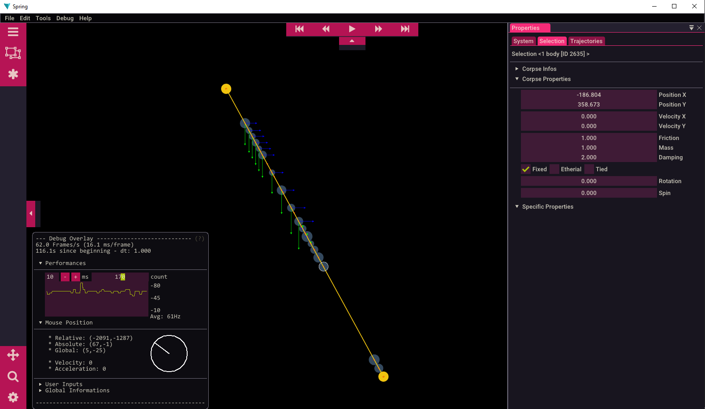
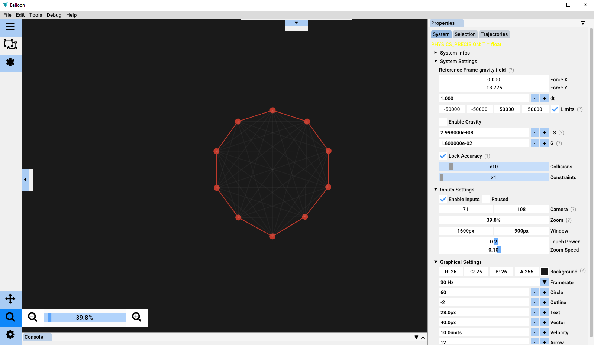
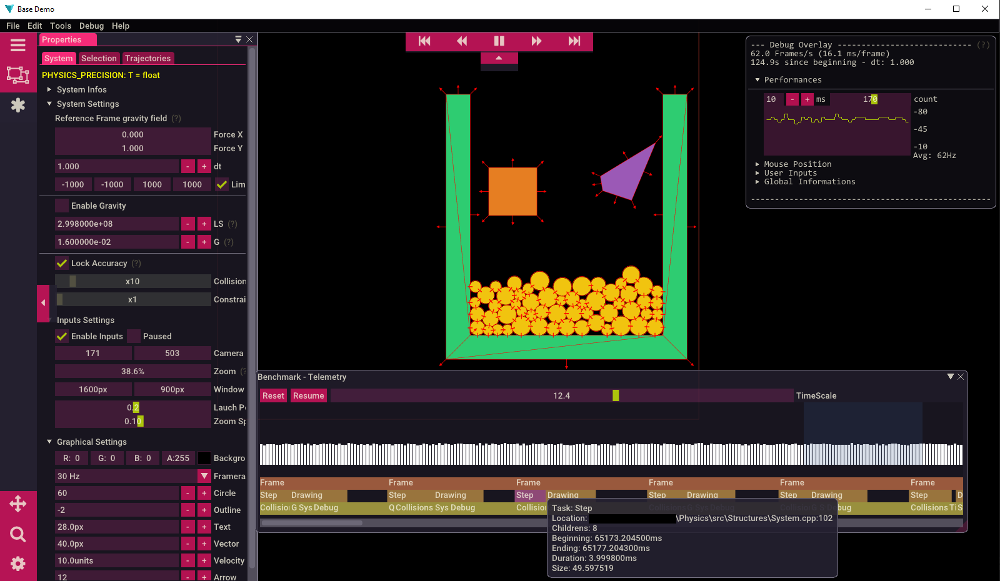
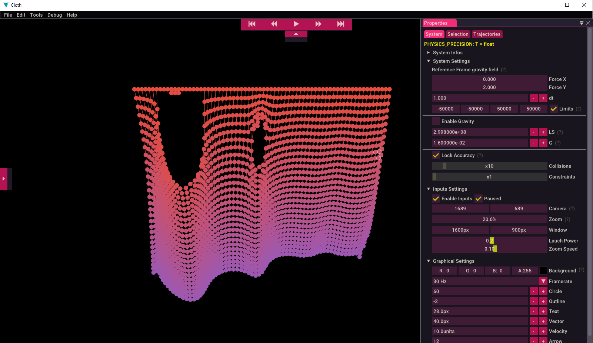
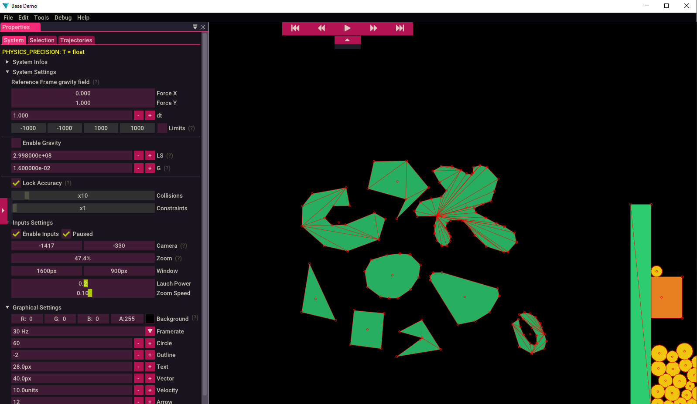
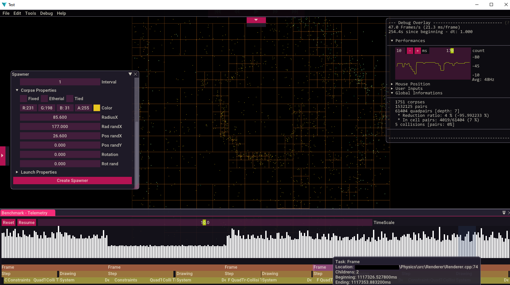
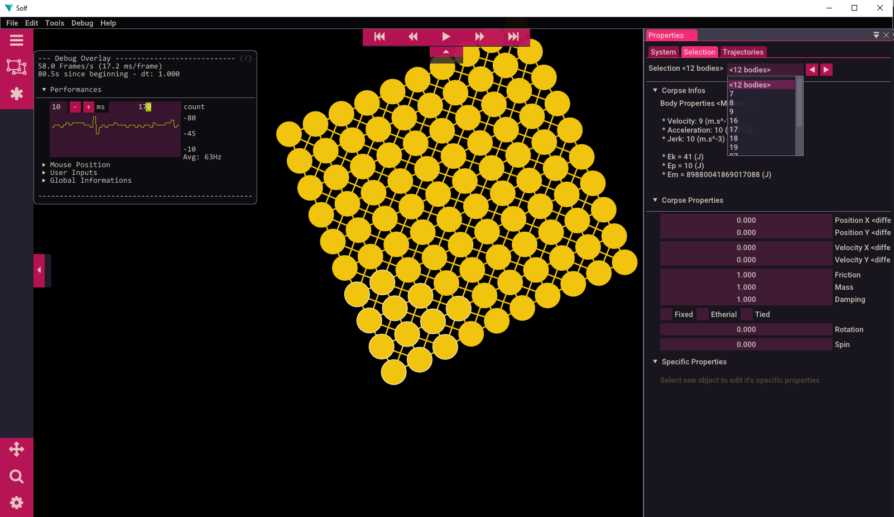
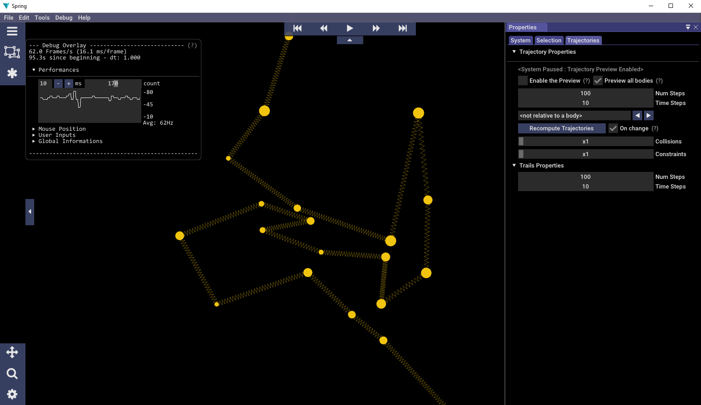

[![Build][build-shield]][build-url]
[![Version][version-shield]][version-url]
[![Language][language-shield]][language-url]
[![Roadmap][roadmap-shield]][roadmap-url]
[![License][license-shield]][license-url]

 

<h2 align="center">SIMULATIO</h2>

A flexible physic engine | Debugging tools.

<a href="">
<strong>Browse the docs »</strong>
</a>
 
 
<a href="https://github.com/mlhoutel/Simulatio/">Screenshots</a>
·
<a href="https://github.com/mlhoutel/Simulatio/issues">Report Bug</a>
·
<a href="https://github.com/mlhoutel/Simulatio/issues">Request Feature</a>

<!-- TABLE OF CONTENTS -->

  
Table of Contents

  <ol>
    <li>
      <a href="#about-the-project">About The Project</a>
      <ul>
        <li><a href="#built-with">Built With</a></li>
        <li><a href="#exemples">Exemples</a></li>
      </ul>
    </li>
    <li>
      <a href="#getting-started">Getting Started</a>
      <ul>
        <li><a href="#prerequisites">Prerequisites</a></li>
        <li><a href="#installation">Installation</a></li>
        <li><a href="#build-docs">Build Docs</a></li>
      </ul>
    </li>
    <li><a href="#contributing">Contributing</a></li>
    <li><a href="#license">License</a></li>
    <li><a href="#authors">Authors</a></li>
  </ol>

<!-- ABOUT THE PROJECT -->

## About The Project

[![Simulatio Screen Shot][screenshot]](https://github.com/mlhoutel/Simulatio/tree/main)

This project started from a personal challenge: recreate **physical principles** in a **simulation** running in **real time**. I also wanted this project to easily **convey some understanding** of how it works, as well as **analysis** and **debugging tools**.

The objective was to learn more about such topics as:

-   **Gravity** (Classical mecanics one, he goal was not to model objects at the molecular level)
-   **Collisions** (With Newton's 3rd law)
-   **Friction** (Approximation with dissipation in heat)
-   **Electromagnetic fields** (_IN WORK_, see https://github.com/mlhoutel/Fields)
-   **Fluids** (_IN WORK_)

This project also allows me to familiarize myself with several areas of programming, such as:

-   **Graph Theory** and advanced **Data structures** like Quadtrees
-   **C++ programs/libraries** compilation (Mingw batch/ CMake)
-   **Memory allocation** and **Classes Inheritances**
-   **Optimisation** and **Algoritmics**
-   **Threads** and **Graphical acceleration** with CUDA (?)

---

As this program is oriented towards testing and comparison, a modular structure has been set up.

**Modularity:**

-   **Precision** (at build time):
    -   [x] float
    -   [x] double
-   **Dimension** (at build time):
    -   [x] 2D
    -   [ ] 3D
-   **Broad phase structure** (at run time):
    -   [ ] Spacial grid
    -   [x] Quad-tree
    -   [ ] kD-tree
-   **Integration method** (at run time):
    -   [ ] Euler
    -   [x] Verlet
    -   [ ] RK4

---

To summarize this is an introduction to the basic concepts and functions of 2D physical simulation (applicable to 3D thereafter).

The ultimate goal would be to present an easy-to-use and optimized physical engine, a bit like a simplified "Algodoo".

Currently in dev, you can see a very messy roadmap [here](https://github.com/users/mlhoutel/projects/3)

---

(<a href="#top">back to top</a>)

### Exemples

[Browse all screenshots](./docs/screenshots/ScreenShots.md)

(<a href="#top">back to top</a>)

### Built With

-   [SFML](https://github.com/SFML/SFML) - The Graphical library
-   [ImGui](https://github.com/ocornut/imgui) - The GUI library
-   [ImGui::SFML](https://github.com/eliasdaler/imgui-sfml) - The Binder library

(<a href="#top">back to top</a>)

<!-- GETTING STARTED -->

## Getting Started

**[Official documentation](https://github.com/mlhoutel/Simulatio/build.html)**

## Contributing

Contributions are what make the open source community such an amazing place to learn, inspire, and create. Any contributions you make are **greatly appreciated**.

If you have a suggestion that would make this better, please fork the repo and create a pull request. You can also simply open an issue with the tag "enhancement".
Don't forget to give the project a star! Thanks again!

1. Fork the Project
2. Create your Feature Branch (`git checkout -b feature/AmazingFeature`)
3. Commit your Changes (`git commit -m 'Add some AmazingFeature'`)
4. Push to the Branch (`git push origin feature/AmazingFeature`)
5. Open a Pull Request

Please read [CONTRIBUTING.md](CONSTRIBUTING.md) for details on our code of conduct, and the process for submitting pull requests to us.

(<a href="#top">back to top</a>)

<!-- LICENSE -->

## License

Distributed under the MIT License. See `LICENSE.txt` for more information.

(<a href="#top">back to top</a>)

<!-- ACKNOWLEDGMENTS -->

## Authors

-   **LHOUTELLIER Maël** - _Initial work_ - [mlhoutel](https://github.com/mlhoutel)

(<a href="#top">back to top</a>)

[build-shield]: https://img.shields.io/github/workflow/status/mlhoutel/Simulatio/Build/main?style=flat-square
[build-url]: https://github.com/mlhoutel/Simulatio/blob/main/.github/workflows/docs.yml
[version-shield]: https://img.shields.io/badge/version-0.5.2-orange?style=flat-square
[version-url]: https://github.com/mlhoutel/Simulatio/blob/main/CMakeLists.txt
[language-shield]: https://img.shields.io/github/languages/top/mlhoutel/Simulatio?style=flat-square
[language-url]: https://github.com/mlhoutel/Simulatio/search?l=cpp
[roadmap-shield]: https://img.shields.io/badge/roadmap-available-brightgreen?style=flat-square
[roadmap-url]: https://github.com/users/mlhoutel/projects/3
[license-shield]: https://img.shields.io/github/license/mlhoutel/Simulatio?style=flat-square
[license-url]: https://github.com/mlhoutel/Simulatio/blob/main/LICENSE/
[logo]: ./src/assets/logo.png
[screenshot]: ./docs/screenshots/Pictures/Benchmarking.png
