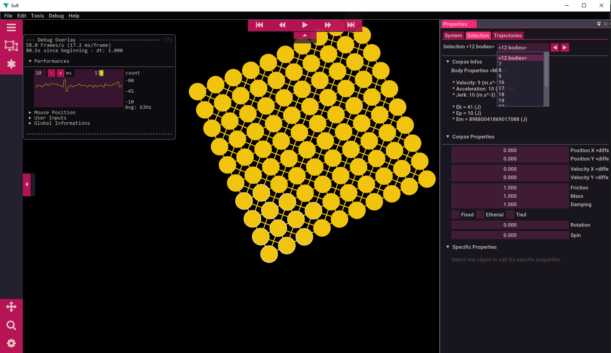

<div id="top"></div>

[![Build][build-shield]][build-url]
[![Version][version-shield]][version-url]
[![Language][language-shield]][language-url]
[![Roadmap][roadmap-shield]][roadmap-url]
[![License][license-shield]][license-url]

<br />
<div align="center">
<a href="https://github.com/mlhoutel/Physics/tree/develop">

</a>

<h2 align="center">PHYSICS</h2>

<p align="center">A flexible physic engine | Debugging tools.</p>
<p align="center">
<a href="">
<strong>Browse the docs »</strong>
</a>
<br />
<br />
<a href="https://github.com/mlhoutel/Physics/">Screenshots</a>
·
<a href="https://github.com/mlhoutel/Physics/issues">Report Bug</a>
·
<a href="https://github.com/mlhoutel/Physics/issues">Request Feature</a>
</p>
</div>

<!-- TABLE OF CONTENTS -->

<details>
  <summary>Table of Contents</summary>
  <ol>
    <li>
      <a href="#about-the-project">About The Project</a>
      <ul>
        <li><a href="#built-with">Built With</a></li>
        <li><a href="#exemples">Exemples</a></li>
      </ul>
    </li>
    <li>
      <a href="#getting-started">Getting Started</a>
      <ul>
        <li><a href="#prerequisites">Prerequisites</a></li>
        <li><a href="#installation">Installation</a></li>
      </ul>
    </li>
    <li><a href="#contributing">Contributing</a></li>
    <li><a href="#license">License</a></li>
    <li><a href="#authors">Authors</a></li>
  </ol>
</details>

<!-- ABOUT THE PROJECT -->

## About The Project

[![Physics Screen Shot][screenshot]](https://example.com)

This project started from the personal challenge of recreating physical phenomena in a simulation running in real time.

The goal was to learn more about the functioning of these topics, such as:

-   **Gravity** (My goal was not to model objects at the molecular level so I used the classical mecanics one)
-   **Collisions** (3rd law of Newton/Reciprocal force between two bodies)
-   **Friction** (Approximation with dissipation in heat)
-   **Fluids** (IN DEV)
-   **Electromagnetic fields** (IN DEV, see https://github.com/mlhoutel/Fields)

This project also allows me to familiarize myself with several areas of programming, like:

-   **Graph Theory** and advanced **Data structures** like Quadtrees
-   **C++ programs/libraries** compilation (Mingw batch/ CMake)
-   **Memory allocation** and **Classes Inheritances**
-   **Optimisation**
-   **Threads** and Graphical acceleration with CUDA (?)

---


To summarize this is an introduction to the basic concepts and functions of 2D physical simulation (applicable to 3D thereafter).

The ultimate goal would be to present an easy-to-use and optimized physical engine, a bit like a simplified "Algodoo".

Currently in dev, you can see a very messy roadmap [here](https://github.com/users/mlhoutel/projects/3)

---

<p align="right">(<a href="#top">back to top</a>)</p>

### Exemples

[Browse all screenshots](./docs/ScreenShots/ScreenShots.md)

<div float="left">




<div>

<p align="right">(<a href="#top">back to top</a>)</p>

### Built With

-   [SFML](https://github.com/SFML/SFML) - The Graphical library
-   [ImGui](https://github.com/ocornut/imgui) - The GUI library
-   [ImGui::SFML](https://github.com/eliasdaler/imgui-sfml) - The Binder library

<p align="right">(<a href="#top">back to top</a>)</p>

<!-- GETTING STARTED -->

## Getting Started

### Prerequisites

#### **C++ compiler**

<details open>
  <summary style="padding: 5px"><code>For Windows</code></summary>

**MINGW 32**

-   1. Download with [MinGW 32 bits](https://osdn.net/projects/mingw/downloads/68260/mingw-get-setup.exe/).
-   2. After the download is complete, launch the program and wait for the download to finish.
-   3. When you get to the **MinGW Installation Manager** page, check all the boxes.
-   4. Then click on the **Installation** button then **Apply Changes**.

**MINGW 64**

-   1. Download with [MinGW 64 bits](https://sourceforge.net/projects/mingw-w64/files/Toolchains%20targetting%20Win32/Personal%20Builds/mingw-builds/installer/mingw-w64-install.exe/download).
-   2. Select the architecture **x86_64** and the treads to **posix**
-   3. Then click on the **Next** and wait until it's downloaded.

**ENV VARS**

You must then add the **environment variable** to your compiler:

-   1. Type **env** in the windows search bar and open **Edit the environment variables**.
-   2. Then click on **Environment variables** in **Avanced System Parameters**.
-   3. Click on the **Path** field then on **Edit**.
-   4. **Add** the path to the emplacement of the compiler: `...\Mingw\bin`

Check if it works by opening a new command line and typing:

```
> gcc

gcc: fatal error: no input files
compilation terminated.
```

</details>

<details>
  <summary style="padding: 5px"><code>For Linux</code></summary>
  
  ``TODO``

</details>

#### **CMAKE**

<details open>
  <summary style="padding: 5px"><code>For Windows</code></summary>

Install the cmake software that I use to controll the build process, and also build the libraries:

-   1. Go to http://www.cmake.org/download/ and click on the **Download button**.
-   2. Add it's path to then environment variables: `...\CMake\bin`

</details>

<details>
  <summary style="padding: 5px"><code>For Linux</code></summary>
  
  ``TODO``

</details>

<p align="right">(<a href="#top">back to top</a>)</p>

### Libraries

#### **SFML**

-   1. Download precompiled library from https://www.sfml-dev.org/download/sfml/2.5.1/index-fr.php

Or compile it yourself:

-   1. Open a **new cmd** and type `git clone https://github.com/SFML/SFML.git`
-   2. Open **CMake** and put the path to the **SFML source code** into the **Where is the source code** field.
-   3. Create a **new folder** where to compile SFML
-   4. Put it's path into the **Where to build the binaries** field.
-   5. Click on the **Configure** button and select your c/c++ compiler
-   6. Click on **finish**.

> **<details><summary style="padding: 5px"><code>To compile SFML in static</code></summary>**
>
> **Static:** don't need the .dll for the .exe to work
>
> -   1. Uncheck **BUILD_SHARED_LIBS**
> -   2. Check **SFML_USE_STATIC_STD_LIBS**
> -   3. Edit the **CMake_INSTALL_PREFIX** to be the path of a new folder.
> -   4. Click the **Configure** button once more to check there is no problem.
> -   5. Then click on the **Generate** button.
> -   6. Open a new command in the folder where SFML was built.
> -   7. Run the following command: `mingw32-make install`

</details>

<p align="right">(<a href="#top">back to top</a>)</p>

#### **IMGUI**

-   1. Open a **new cmd** and type `git clone https://github.com/ocornut/imgui.git`
-   2. Go to the docking branch with `git checkout docking`

```
IMGUI_DIR = D:/Librairies/imgui
SFML_DIR = D:/Librairies/sfml_2_5_1/sfml_2_5_1_build/lib/cmake/SFML
SFML_DOC_DIR = D:/Librairies/sfml_2_5_1/sfml_2_5_1_build/lib/cmake/SFML
CMAKE_INSTALL_PREFIX = D:/Librairies/imgui_sfml
```

```
cmake . -D SFML_DIR="D:\Librairies\sfml_2_5_1/sfml_2_5_1_build\lib\cmake\SFML"
cmake D:\Librairies\imgui-sfml -DIMGUI_DIR=D:\Librairies\imgui -DSFML_DIR=D:\Librairies\sfml_2_5_1\sfml_2_5_1_build
```

-   3. Then open a new command in the folder where IMGUI was built.
-   4. Run the following command: `mingw32-make install`

### Installation

**To fetch the project files**

1. Clone this project with `git clone https://github.com/mlhoutel/Physics.git` <br/> _(or just click on the download button and extract the file where you want.)_

**<details style="padding: 20px"><summary>[Structure details]</summary>**

<p>
The cloned project should contain these files:

```
├───.git
├───.vscode
├───assets          # Fonts, Libraries and Images
├───bin             # All binaries files
│   │───Demos       # Demos of functionnalities and performances
│   └───Saves       # Saved binaries of the precedent versions
=========================================================
├───build           # Where the project is compiled
│   │───Debug       # Debug binaries
│   └───Release     # Release binaries
=========================================================
├───docs            # Documentatiion and screenshots
├───include         # Headers files (.hpp)
└───src             # Sources files (.cpp)
```

</p>
</details>

**Build with the batch tool**

-   0. Build/Run Debug
-   1. Run Debug
-   2. Build/Run Release
-   3. Run Release
-   4. Build Demos
-   5. Build/Run Tests
-   6. Commit/Push Git
-   7. Build Wrapper
-   8. Sonar Scanner
-   9. Exit

**In case of problem with the bat file, compile manually with**

```
cd build

and

cmake -G "MinGW Makefiles" -DCMAKE_BUILD_TYPE=Release ../.. && cmake --build .

or

cmake -G "MinGW Makefiles" -DCMAKE_BUILD_TYPE=Debug ../.. && cmake --build .
```

<p align="right">(<a href="#top">back to top</a>)</p>

<!-- CONTRIBUTING -->

## Contributing

Contributions are what make the open source community such an amazing place to learn, inspire, and create. Any contributions you make are **greatly appreciated**.

If you have a suggestion that would make this better, please fork the repo and create a pull request. You can also simply open an issue with the tag "enhancement".
Don't forget to give the project a star! Thanks again!

1. Fork the Project
2. Create your Feature Branch (`git checkout -b feature/AmazingFeature`)
3. Commit your Changes (`git commit -m 'Add some AmazingFeature'`)
4. Push to the Branch (`git push origin feature/AmazingFeature`)
5. Open a Pull Request

Please read [CONTRIBUTING.md](CONSTRIBUTING.md) for details on our code of conduct, and the process for submitting pull requests to us.

<p align="right">(<a href="#top">back to top</a>)</p>

<!-- LICENSE -->

## License

Distributed under the MIT License. See `LICENSE.txt` for more information.

<p align="right">(<a href="#top">back to top</a>)</p>

<!-- ACKNOWLEDGMENTS -->

## Authors

-   **LHOUTELLIER Maël** - _Initial work_ - [mlhoutel](https://github.com/mlhoutel)

<p align="right">(<a href="#top">back to top</a>)</p>

[build-shield]: https://img.shields.io/github/workflow/status/mlhoutel/Physics/Build/main?style=flat-square
[build-url]: https://github.com/mlhoutel/Physics/main/.github/workflows/main.yml
[version-shield]: https://img.shields.io/badge/version-0.5.2-orange?style=flat-square
[version-url]: https://github.com/mlhoutel/Physics/blob/main/CMakeLists.txt
[language-shield]: https://img.shields.io/github/languages/top/mlhoutel/Physics?style=flat-square
[language-url]: https://github.com/mlhoutel/Physics/search?l=cpp
[roadmap-shield]: https://img.shields.io/badge/roadmap-available-brightgreen?style=flat-square
[roadmap-url]: https://github.com/users/mlhoutel/projects/3
[license-shield]: https://img.shields.io/github/license/mlhoutel/Physics?style=flat-square
[license-url]: https://github.com/mlhoutel/Physics/blob/main/LICENSE/
[logo]: ./src/assets/logo.png
[screenshot]: ./docs/ScreenShots/Pictures/Benchmarking.png
