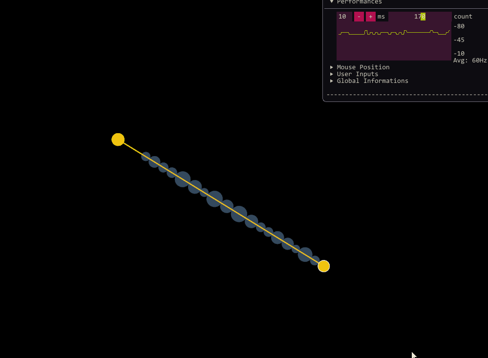
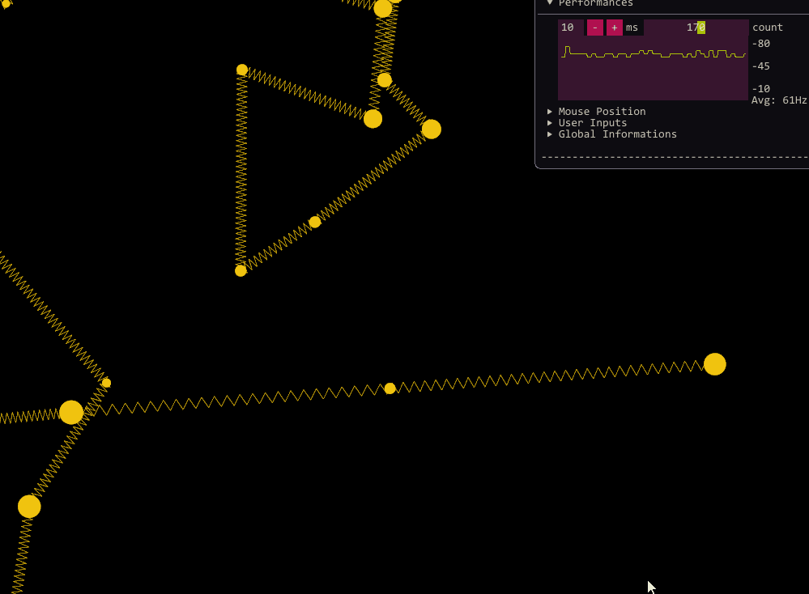

# ScreenShots

[Go back to README](../../README.md#exemples)

### Pictures

### Gifs

<figure align="center">

<figcaption>Conglomerate spawner and quadtree.</figcaption>
</figure>

<figure align="center">

<figcaption>Clothes made with simple constraints.</figcaption>
</figure>

<figure align="center">

<figcaption>Clothes simulation with tearing.</figcaption>
</figure>

<figure align="center">

<figcaption>Trajectory precomputations with gravity.</figcaption>
</figure>

<figure align="center">

<figcaption>Sofbody baloon.</figcaption>
</figure>

<figure align="center">

<figcaption>Slider constraint.</figcaption>
</figure>

<figure align="center">

<figcaption>Spring constraint.</figcaption>
</figure>

